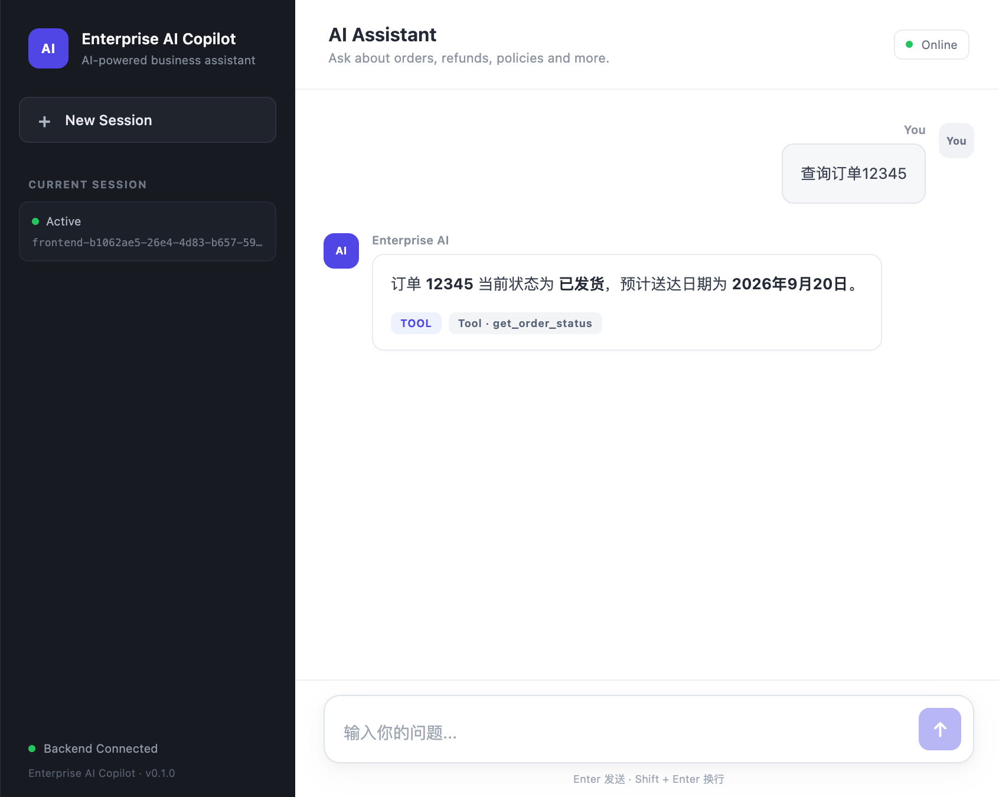
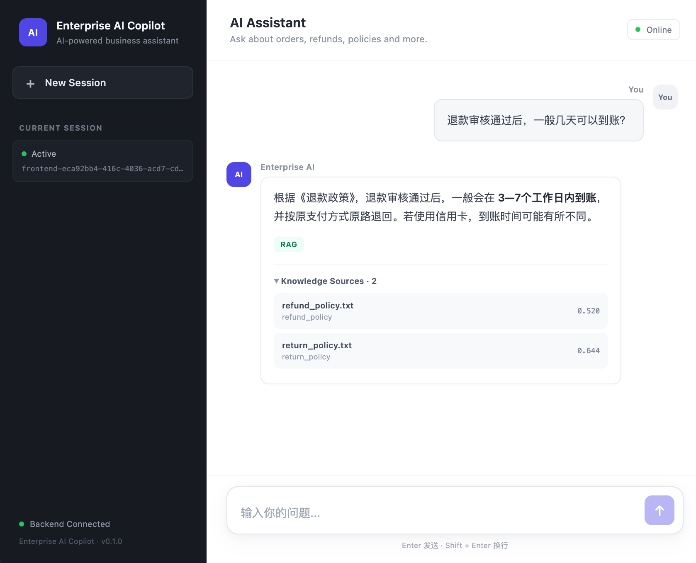
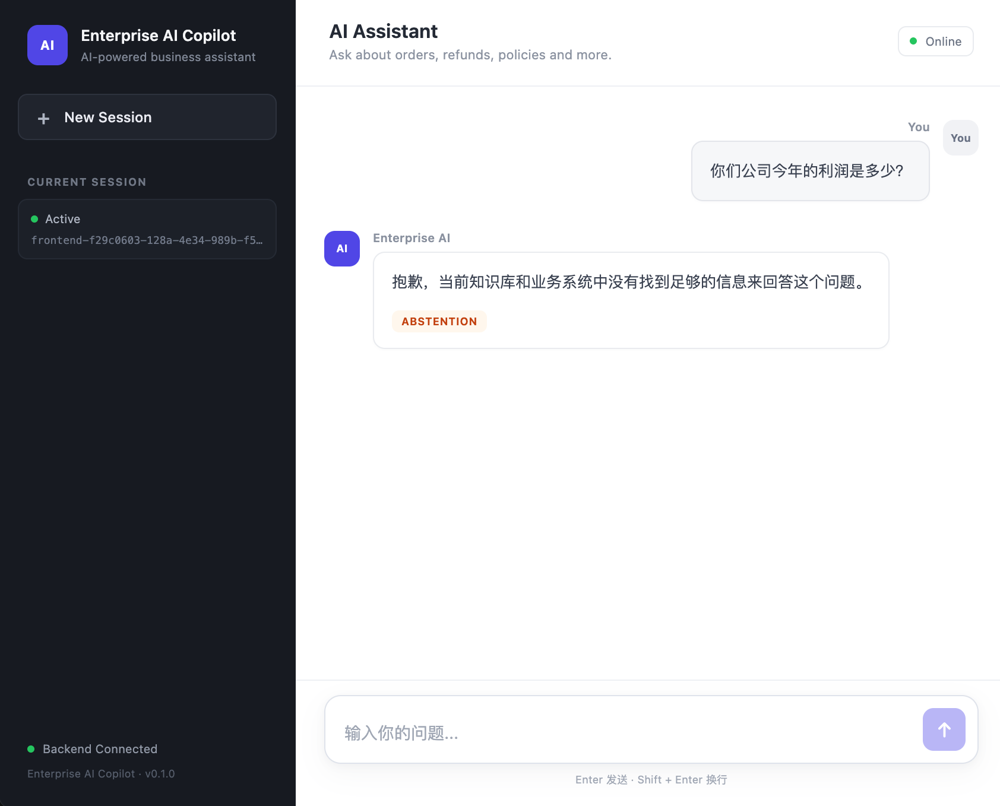

# Enterprise AI Copilot

> A production-oriented enterprise AI assistant built with **LLM + Agent + RAG + Tool Calling + Evaluation + Reliability Testing + React + Docker Compose**.

Enterprise AI Copilot 是一个面向企业业务场景的全栈 AI 应用，围绕订单查询、退款查询、企业知识库问答等真实业务需求，实现了从 **Agent 路由、工具调用、RAG 检索、上下文管理，到 Evaluation、Reliability Testing、Frontend Demo 和 Docker 化交付**的完整工程链路。

---

## 项目定位

这个项目不是简单的 LLM Chat Demo，而是一个经过质量验收的企业 AI Copilot。

核心目标：

```text
真实业务请求
      ↓
Agent Decision
      ↓
┌───────────────┬───────────────┬───────────────┐
│ Order Tool    │ Refund Tool   │ RAG           │
└───────────────┴───────────────┴───────────────┘
      ↓
Grounded / Actionable Answer
      ↓
Evaluation + Reliability
      ↓
Dockerized Full-stack Application
```

当前已经完成：

* Agent 路由
* Tool Calling
* RAG 知识库问答
* Session / Context
* Agent Abstention
* Evaluation
* Reliability Testing
* React Chat UI
* Nginx
* PostgreSQL
* Redis
* Chroma
* Docker Compose

---

## 核心业务场景

### 1. 订单查询

用户：

```text
帮我查询订单12345
```

Agent 判断需要调用订单工具：

```text
Agent
  ↓
get_order_status
  ↓
Order Service
  ↓
Structured Business Result
  ↓
Final Answer
```

示例：

```text
订单 12345 当前状态：已发货
预计送达日期：2026年9月20日
```

---

### 2. 退款状态查询

Agent 根据用户请求调用退款工具：

```text
get_refund_status
```

系统返回结构化业务数据，再由 Agent 生成最终回答。

---

### 3. 企业知识库问答

用户：

```text
退款审核通过后，一般几天可以到账？
```

系统执行：

```text
User Query
    ↓
Embedding
    ↓
Chroma Retrieval
    ↓
Relevant Knowledge
    ↓
LLM Grounded Generation
    ↓
Answer + Knowledge Sources
```

示例：

```text
根据《退款政策》，退款审核通过后，一般会在
3—7 个工作日内按原支付方式原路到账。
若使用信用卡，到账时间可能有所不同。
```

前端同时展示 Knowledge Sources，帮助用户查看回答依据。

---

### 4. Agent Abstention

对于系统没有可靠数据的问题，例如：

```text
你们公司今年利润是多少？
```

Agent 不会编造答案，而是进入：

```text
unknown / abstention
```

这是项目 Reliability 设计的重要部分。

---

# 系统架构

```text
                         Internet / Browser
                                │
                                ▼
                    ┌─────────────────────┐
                    │ React Frontend      │
                    │ + Nginx             │
                    │ :5174               │
                    └──────────┬──────────┘
                               │ /chat
                               ▼
                    ┌─────────────────────┐
                    │ FastAPI Application │
                    │ :8000               │
                    └──────────┬──────────┘
                               │
                               ▼
                    ┌─────────────────────┐
                    │ Agent               │
                    │ Decision / Context  │
                    └──────────┬──────────┘
                               │
              ┌────────────────┼────────────────┐
              ▼                ▼                ▼
       ┌────────────┐   ┌────────────┐   ┌────────────┐
       │ Order Tool │   │ Refund     │   │ RAG        │
       │            │   │ Tool       │   │ Retrieval  │
       └────────────┘   └────────────┘   └─────┬──────┘
                                               │
                                               ▼
                                         ┌──────────┐
                                         │ Chroma   │
                                         └──────────┘

                    ┌────────────────────────────┐
                    │ PostgreSQL                 │
                    │ Session / Message Storage  │
                    └────────────────────────────┘

                    ┌────────────────────────────┐
                    │ Redis                      │
                    │ Cache                      │
                    └────────────────────────────┘
```

---

# 技术栈

## Backend

| 技术          | 用途                            |
| ----------- | ----------------------------- |
| Python 3.13 | Backend runtime               |
| FastAPI     | REST API                      |
| Uvicorn     | ASGI server                   |
| Pydantic    | Request / response validation |
| uv          | Python dependency management  |

## AI

| 技术                     | 用途                             |
| ---------------------- | ------------------------------ |
| LLM API                | Agent reasoning / generation   |
| Agent                  | Request routing                |
| Tool Calling           | Business operation execution   |
| Chroma                 | Vector database                |
| FastEmbed              | Text embedding                 |
| BAAI/bge-small-zh-v1.5 | Chinese embedding model        |
| RAG                    | Enterprise knowledge retrieval |

## Data

| 技术            | 用途                            |
| ------------- | ----------------------------- |
| PostgreSQL 16 | Session / message persistence |
| Redis 8       | Cache                         |
| Chroma        | Knowledge retrieval           |

## Frontend

| 技术             | 用途                                 |
| -------------- | ---------------------------------- |
| React 19       | UI                                 |
| TypeScript     | Frontend development               |
| Vite           | Build / development                |
| React Markdown | Markdown rendering                 |
| Nginx          | Static serving / API reverse proxy |

## Infrastructure

```text
Docker
Docker Compose
Nginx
```

---

# Agent Architecture

Agent 不直接承担所有业务逻辑，而是根据请求选择对应能力。

```text
User Message
     │
     ▼
Agent Decision
     │
     ├── Order Query
     │      └── get_order_status
     │
     ├── Refund Query
     │      └── get_refund_status
     │
     ├── Knowledge Query
     │      └── RAG
     │
     └── Unsupported / Unknown
            └── Abstention
```

核心原则：

> LLM 负责理解和决策，Python 负责业务执行与系统控制。

## Architecture

```mermaid
flowchart TD
    U[User] --> FE[React Frontend + Nginx]
    FE --> API[FastAPI]
    API --> AG[Agent]

    AG --> OT[Order Tool]
    AG --> RT[Refund Tool]
    AG --> RAG[RAG]

    RAG --> C[Chroma]

    API --> PG[PostgreSQL]
    API --> REDIS[Redis]

    AG --> LLM[LLM]

---

# RAG Pipeline

知识库采用向量检索方式：

```text
Knowledge Documents
        ↓
Chunking
        ↓
Embedding
        ↓
Chroma
        ↓
Similarity Search
        ↓
Relevant Chunks
        ↓
LLM
        ↓
Grounded Answer
```

RAG 回答同时保留来源信息：

```json
{
  "document_id": "refund_policy",
  "source": "refund_policy.txt",
  "distance": 0.5079
}
```

前端可以展开查看 Knowledge Sources。

---

# Context & Session

系统支持基于 `session_id` 的多轮交互。

```text
Session
  │
  ├── Message History
  │
  └── Business Context
       ├── current_order_id
       └── other session state
```

Session 数据通过 PostgreSQL 持久化，Redis 用于缓存。

因此 Agent 不只是单轮：

```text
User → Question → Answer
```

而能够支持：

```text
User
 ↓
Context
 ↓
Agent
 ↓
Tool / RAG
 ↓
Updated Context
 ↓
Next Turn
```

---

# Evaluation

项目建立了独立 Evaluation Dataset，对 Agent 行为进行自动化验收。

当前 Evaluation：

```text
Total Cases:       24
Passed:            24
Pass Rate:         100%
RAG Cases:         10
RAG Grounded:      10 / 10
Quality Gate:      PASSED
```

运行：

```bash
python tests/evaluation/run_eval.py
```

Evaluation Dataset：

```text
evaluation/dataset.json
```

Evaluation Report：

```text
evaluation/evaluation_report.json
```

Evaluation 覆盖：

* Order routing
* Refund routing
* RAG retrieval
* Knowledge grounding
* Unknown / abstention
* Context-dependent requests
* Expected business behavior

---

# Reliability Testing

项目进一步增加 Agent Reliability 测试。

当前自动化测试：

```text
32 passed
```

测试覆盖：

```text
tests/reliability/
├── test_agent_decision.py
├── test_rag.py
├── test_rag_agent.py
└── test_tools.py
```

重点验证：

* Tool exception
* Invalid business input
* Redis failure
* RAG failure
* Missing knowledge
* Irrelevant questions
* Agent abstention
* Agent routing
* Context-dependent behavior

最终目标不是让 Agent “什么都回答”，而是：

> **能正确执行时执行；没有可靠依据时拒答；系统组件异常时保持可控。**

---

# Frontend

Frontend 提供完整 Chat Demo。

主要功能：

* Chat interface
* New Session
* Session ID
* Markdown rendering
* Loading state
* Network error handling
* Tool badge
* RAG badge
* Abstention badge
* Knowledge Sources
* Source document
* Retrieval distance
* Mobile responsive layout

示例：

```text
┌──────────────────────────────────────────────┐
│ Enterprise AI Copilot                       │
├──────────────┬───────────────────────────────┤
│              │ User                          │
│ New Session  │ 帮我查询订单12345             │
│              │                               │
│ Backend      │ AI                            │
│ Connected    │ 订单12345当前状态：已发货     │
│              │                               │
│ Session ID   │ [Tool] get_order_status       │
│              │                               │
│              │ Knowledge Sources              │
│              │ └─ refund_policy.txt           │
├──────────────┴───────────────────────────────┤
│ Ask Enterprise AI...                  Send   │
└──────────────────────────────────────────────┘
```

---

# Docker Architecture

整个项目可以通过 Docker Compose 启动：

```text
docker-compose
│
├── frontend
│   └── React build + Nginx
│
├── app
│   └── FastAPI + Agent
│
├── postgres
│   └── PostgreSQL 16
│
└── redis
    └── Redis 8
```

服务：

| Service    | Container Port | Host Port |
| ---------- | -------------: | --------: |
| Frontend   |             80 |      5174 |
| FastAPI    |           8000 |      8000 |
| PostgreSQL |           5432 |      5433 |
| Redis      |           6379 |      6380 |

Frontend 使用 Nginx 将：

```text
/chat
```

反向代理到：

```text
app:8000
```

因此浏览器不需要直接访问 Backend Container。

---

# Quick Start

## Requirements

* Docker Desktop
* Python 3.13+
* uv
* Node.js
* pnpm

## 1. Clone

```bash
git clone https://github.com/fengfirst/enterprise-ai-copilot.git

cd enterprise-ai-copilot
```

## 2. Configure environment

复制环境变量模板：

```bash
cp .env.example .env
```

填写必要的 API Key。

> `.env` 不提交到 Git。

## 3. Start full stack

```bash
docker compose up -d --build
```

检查：

```bash
docker compose ps
```

## 4. Health check

```bash
curl http://127.0.0.1:8000/health
```

Expected:

```json
{
  "status": "ok",
  "service": "enterprise-ai-copilot"
}
```

## 5. Open frontend

```text
http://127.0.0.1:5174
```

---

# API Example

请求：

```bash
curl -X POST http://127.0.0.1:8000/chat \
  -H "Content-Type: application/json" \
  -d '{
    "session_id": "demo-001",
    "message": "帮我查询订单12345"
  }'
```

示例响应：

```json
{
  "session_id": "demo-001",
  "type": "tool",
  "answer": "订单 12345 当前状态：已发货",
  "sources": [],
  "tool": "get_order_status"
}
```

---

# Project Structure

```text
enterprise-ai-copilot/
│
├── backend/
│   ├── agent/
│   │   └── service.py
│   │
│   ├── api/
│   │   └── chat.py
│   │
│   ├── cache/
│   ├── core/
│   ├── db/
│   ├── rag/
│   ├── session/
│   ├── tools/
│   │   ├── order.py
│   │   └── refund.py
│   │
│   └── main.py
│
├── frontend/
│   ├── src/
│   │   ├── App.tsx
│   │   ├── App.css
│   │   └── main.tsx
│   ├── Dockerfile
│   └── nginx.conf
│
├── evaluation/
│   ├── dataset.json
│   └── evaluation_report.json
│
├── tests/
│   ├── evaluation/
│   └── reliability/
│
├── data/
│   └── chroma/
│
├── Dockerfile
├── docker-compose.yml
├── pyproject.toml
├── uv.lock
└── README.md
```

---

# Engineering Highlights

## 1. Agent 不只是 Prompt

系统将：

```text
Intent
→ Decision
→ Tool / RAG
→ Business Result
→ Final Answer
```

拆成可测试的工程流程。

---

## 2. RAG 有质量验收

不是只实现：

```text
Vector Search
```

而是进一步建立：

```text
Dataset
→ Retrieval
→ Grounding
→ Evaluation
→ Quality Gate
```

当前：

```text
24 / 24 passed
10 / 10 RAG grounded
```

---

## 3. Agent 支持 Abstention

当系统缺乏可靠依据时：

```text
Unknown
```

而不是让 LLM 猜测。

这降低了企业业务场景中的幻觉风险。

---

## 4. Reliability First

系统对：

* Tool errors
* Cache failures
* RAG failures
* Missing knowledge
* Unsupported questions

都有自动化测试。

当前：

```text
32 tests passed
```

---

## 5. Full-stack Delivery

项目不是只有 Backend：

```text
React
+
Nginx
+
FastAPI
+
Agent
+
RAG
+
PostgreSQL
+
Redis
+
Docker Compose
```

能够作为一个完整应用运行。

---

# Current Status

```text
Phase A  RAG / Agent Quality Acceptance    ✅
Phase B  Agent Reliability                 ✅
Phase C  Frontend Demo                     ✅
D1       Backend Docker                    ✅
D2       PostgreSQL + Redis                ✅
D3       Frontend + Nginx                 ✅
D4       Full-stack Docker                ✅
D5       Local Deployment                 ✅
Phase E  GitHub Portfolio                 🚧
```

当前 GitHub Repository：

```text
https://github.com/fengfirst/enterprise-ai-copilot
```

---

# Roadmap

后续工程方向：

```text
Phase A
RAG / Agent Quality
        ↓
Phase B
Agent Reliability
        ↓
Phase C
Frontend Demo
        ↓
Phase D
Docker / Deployment
        ↓
Phase E
GitHub Portfolio
```

最终目标：

> 从真实业务需求出发，独立完成 AI 系统架构、Agent/RAG、Evaluation、Reliability、Frontend、Docker、Deployment 与 Portfolio 交付。

---

# License

This project is intended for learning, engineering practice, and portfolio demonstration.

## Demo

### Order Tool



### RAG & Knowledge Sources



### Agent Abstention


